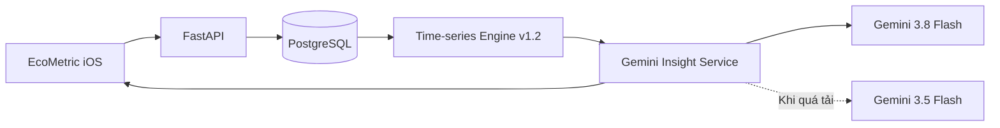

# EcoMetric Backend

Backend dữ liệu và AI cho EcoMetric, cung cấp xác thực doanh nghiệp, phân quyền thành viên, lưu trữ số đo thực tế, phân tích chuỗi thời gian, phát hiện bất thường, Gemini AI Insight và xếp hạng giải pháp tiết kiệm năng lượng.

> Các con số năng lượng và tài chính được tạo bởi engine xác định, không do mô hình ngôn ngữ tự sinh. Gemini chỉ diễn giải dữ kiện đã kiểm tra, nêu giả thuyết, đề xuất hành động và chỉ số cần đo lại.

## Kiến trúc AI hiện tại



Luồng này giữ số liệu định lượng có thể kiểm chứng ở backend, đồng thời dùng Gemini cho phần diễn giải tiếng Việt và kế hoạch hành động.

## Chạy local

```bash
python3 -m venv .venv
source .venv/bin/activate
python -m pip install -r requirements.txt
python run.py --reload
```

API mặc định chạy tại `http://127.0.0.1:8000`. Tài liệu tương tác có tại `/docs`.

## PostgreSQL và migration

Sao chép cấu hình mẫu rồi điền mật khẩu PostgreSQL cục bộ:

```bash
cp .env.example .env
```

Không commit file `.env`. Sau khi PostgreSQL đang chạy, tạo hoặc nâng cấp cấu trúc bảng bằng:

```bash
./.venv/bin/alembic upgrade head
./.venv/bin/alembic current
```

Hai migration hiện tại tạo các nhóm bảng:

- `organizations`, `users`, `auth_sessions`: doanh nghiệp, vai trò và phiên đăng nhập;
- `facilities`: cơ sở hoặc nhà xưởng;
- `meters`: đồng hồ gắn với từng cơ sở;
- `datasets`: thông tin một lần nhập dữ liệu;
- `measurements`: từng điểm đo điện năng, sản lượng và giờ vận hành.

Mọi `facility`, `dataset` và `measurement` được gắn với doanh nghiệp. Token của công ty này không thể đọc hoặc phân tích dữ liệu của công ty khác.

### Tài khoản và phân quyền

1. `POST /v1/auth/registration-otp`: gửi OTP 6 số tới email đăng ký.
2. `POST /v1/auth/register-company`: xác minh OTP, tạo công ty và tài khoản `owner` đầu tiên.
3. `POST /v1/auth/login`: nhận Bearer token có thời hạn 30 ngày.
4. `GET /v1/auth/me`: đọc người dùng, vai trò, gói và giới hạn tài khoản.
5. `POST /v1/organization/members`: owner/admin tạo tài khoản theo email. Chỉ owner được cấp vai trò admin.
6. `PATCH /v1/organization/members/{id}`: đổi vai trò hoặc kích hoạt/vô hiệu hóa tài khoản.
7. `POST /v1/auth/change-password`: đổi mật khẩu tạm trước khi truy cập dữ liệu doanh nghiệp.

Mật khẩu được băm bằng PBKDF2-HMAC-SHA256 với salt riêng và 600.000 vòng lặp. Backend chỉ lưu SHA-256 của session token; iOS lưu token gốc trong Keychain.

### Gửi OTP qua email

Khi phát triển local, `ECOMETRIC_EMAIL_DELIVERY_MODE=console` ghi OTP vào log backend và trả mã trong trường `development_code`. Không dùng chế độ này khi triển khai thật.

Để gửi email thật, đặt các biến sau trong `.env`:

```text
ECOMETRIC_EMAIL_DELIVERY_MODE=smtp
ECOMETRIC_SMTP_HOST=smtp.gmail.com
ECOMETRIC_SMTP_PORT=587
ECOMETRIC_SMTP_USERNAME=email_cua_ban@gmail.com
ECOMETRIC_SMTP_PASSWORD=mat_khau_ung_dung
ECOMETRIC_SMTP_FROM_EMAIL=email_cua_ban@gmail.com
ECOMETRIC_SMTP_USE_TLS=true
ECOMETRIC_SMTP_USE_SSL=false
ECOMETRIC_OTP_SECRET=chuoi_bi_mat_ngau_nhien
```

Với Gmail, `SMTP_PASSWORD` phải là App Password, không phải mật khẩu đăng nhập Google. OTP hết hạn sau 10 phút, khóa sau 5 lần nhập sai và có thời gian chờ gửi lại 60 giây.

Khi tạo thành viên, backend chỉ commit tài khoản sau khi SMTP chấp nhận thư mời. Thư bao gồm công ty, vai trò và mật khẩu tạm có hiệu lực 24 giờ. Lần đăng nhập đầu tiên chỉ mở màn hình đổi mật khẩu; sau khi đổi thành công nhân viên mới truy cập ứng dụng.

### Luồng nhập dữ liệu thật

Trong `http://127.0.0.1:8000/docs`, đăng ký hoặc đăng nhập trước, bấm **Authorize** và nhập Bearer token. Sau đó thực hiện theo thứ tự:

1. `POST /v1/facilities` để tạo nhà xưởng và lấy `id`.
2. `POST /v1/datasets/electricity` để gửi các điểm đo thật. Thay `facility_id` bằng `id` ở bước 1.
3. `GET /v1/datasets/{dataset_id}/measurements` để kiểm tra dữ liệu đã lưu.
4. `POST /v1/datasets/{dataset_id}/analyze` để engine định lượng đọc dữ liệu từ PostgreSQL và phân tích.
5. `POST /v1/datasets/{dataset_id}/ai-insight` để nhận kết quả định lượng kèm diễn giải Gemini.

Request mẫu nằm tại `examples/electricity_dataset.json`. Có thể lưu từ một điểm đo, nhưng cần ít nhất 7 điểm để chạy phân tích AI. Hệ thống từ chối điện năng âm và các mốc thời gian bị trùng trong cùng bộ dữ liệu.

## Gemini API

Phần diễn giải và khuyến nghị AI sử dụng Gemini API từ backend. API key không được đặt trong mã nguồn hoặc ứng dụng iOS.

1. Tạo API key tại [Google AI Studio](https://aistudio.google.com/apikey).
2. Mở file `.env` và thêm:

```text
ECOMETRIC_GEMINI_API_KEY=api_key_cua_ban
ECOMETRIC_GEMINI_MODEL=gemini-3.8-flash
ECOMETRIC_GEMINI_FALLBACK_MODEL=gemini-3.5-flash
```

3. Khởi động lại backend và kiểm tra `GET /health`. Trường `gemini` phải là `configured`.
4. Gọi `POST /v1/datasets/{dataset_id}/ai-insight` hoặc nhập dữ liệu từ ứng dụng iOS.

Backend luôn tính đường cơ sở, điện vượt mức và tỷ lệ bất thường trước. Gemini chỉ nhận dữ liệu đã kiểm tra để viết insight có cấu trúc, giả thuyết nguyên nhân và kế hoạch hành động. Prompt cấm Gemini tự tạo số liệu tài chính, tỷ lệ tiết kiệm hoặc xem giả thuyết là kết luận chắc chắn.

`gemini-3.8-flash` là model chính. Nếu Google tạm thời trả lỗi quá tải, service sẽ thử lại và tự chuyển sang `gemini-3.5-flash`; trường `model` trong phản hồi luôn cho biết model thực tế đã tạo insight.

## Kiểm thử nhanh qua HTTP

Giữ backend chạy ở Terminal 1. Tại Terminal 2, chạy:

```bash
cd "ECOMETRIC BACKEND/ecometric-backend"
./.venv/bin/python scripts/smoke_test.py
```

Smoke test kiểm tra health, ranked recommendations, endpoint tương thích iOS, phát hiện bất thường chuỗi thời gian và OpenAPI. Khi hoàn tất, kết quả cuối sẽ là:

```text
EcoMetric Backend đã sẵn sàng để kiểm thử.
```

Hai request mẫu nằm trong thư mục `examples/` và có thể dùng trực tiếp tại `http://127.0.0.1:8000/docs`.

### Kiểm thử trên iOS Simulator

Chạy backend bằng `python run.py`. Ứng dụng mặc định kết nối tới `http://127.0.0.1:8000`, vì vậy không cần đổi Scheme.

### Kiểm thử trên iPhone thật

Khởi chạy backend để nhận kết nối từ mạng LAN:

```bash
python run.py --host 0.0.0.0
```

Sau đó đặt `ECOMETRIC_API_BASE_URL` trong Scheme thành `http://<IP-của-Mac>:8000`. Mac và iPhone phải ở cùng mạng Wi-Fi; macOS Firewall cần cho phép kết nối đến Python.

## API

- `POST /v1/auth/registration-otp`: gửi mã xác minh tới email đăng ký.
- `POST /v1/auth/register-company`: tạo doanh nghiệp và tài khoản chủ sở hữu.
- `POST /v1/auth/login`: đăng nhập và tạo phiên.
- `GET /v1/auth/me`: thông tin tài khoản và doanh nghiệp hiện tại.
- `POST /v1/auth/logout`: thu hồi phiên hiện tại.
- `POST /v1/auth/change-password`: thay mật khẩu tạm và mở khóa phiên sử dụng.
- `GET /v1/organization/members`: danh sách thành viên cho owner/admin.
- `POST /v1/organization/members`: tạo thành viên theo email.
- `PATCH /v1/organization/members/{id}`: cập nhật vai trò hoặc trạng thái tài khoản.
- `POST /v1/facilities`: tạo cơ sở hoặc nhà xưởng.
- `GET /v1/facilities`: liệt kê các cơ sở đã lưu.
- `POST /v1/datasets/electricity`: lưu bộ dữ liệu điện năng thực tế.
- `GET /v1/datasets/{id}`: xem thông tin một bộ dữ liệu.
- `GET /v1/datasets/{id}/measurements`: đọc các điểm đo theo thời gian.
- `POST /v1/datasets/{id}/analyze`: chạy phân tích định lượng trên dữ liệu đã lưu trong PostgreSQL.
- `POST /v1/datasets/{id}/ai-insight`: dùng Gemini tạo insight và khuyến nghị có cấu trúc.
- `POST /analyze`: phát hiện cơ hội từ dữ liệu vận hành.
- `POST /analyze/time-series`: phát hiện đột biến và xu hướng tăng từ chuỗi dữ liệu điện.
- `POST /recommendations`: tạo và xếp hạng tất cả giải pháp phù hợp.
- `POST /recommend`: trả giải pháp có điểm cao nhất cho iOS client hiện tại.
- `GET /knowledge/led`: xem knowledge record mẫu.
- `GET /health`: health check.

## Recommendation pipeline

```text
EnergyInput
→ Opportunity Detection
→ Knowledge Retrieval
→ Applicability Rules
→ Calculator Registry
→ Data Quality
→ Conservative / Expected / Optimistic Scenarios
→ Scoring & Ranking
→ Explanation & Verification Plan
```

Mỗi recommendation trả về:

- điểm ưu tiên và các thành phần tạo nên điểm;
- lý do giải pháp phù hợp với dữ liệu đầu vào;
- ba kịch bản tiết kiệm để thể hiện độ bất định;
- giả định, trường dữ liệu còn thiếu và chất lượng nguồn;
- kế hoạch đo lại để kiểm chứng hiệu quả sau triển khai.

## Phân tích chuỗi thời gian

Endpoint `/analyze/time-series` nhận tối thiểu 7 điểm dữ liệu theo giờ, ngày hoặc tháng. Engine sẽ:

1. ưu tiên chuẩn hóa điện năng theo sản lượng;
2. nếu không có sản lượng, chuẩn hóa theo giờ vận hành;
3. nếu thiếu cả hai, phân tích điện năng tuyệt đối và trả thêm câu hỏi bổ sung;
4. dùng median và median absolute deviation để giảm ảnh hưởng của điểm ngoại lệ;
5. phát hiện đột biến cao hơn đường cơ sở ít nhất 20%;
6. so sánh 7 kỳ gần nhất với 7 kỳ trước để phát hiện xu hướng nền tăng.

Kết quả bao gồm điện năng kỳ vọng, phần điện vượt mức, mức độ nghiêm trọng, độ tin cậy và các cơ hội cần điều tra tiếp.

Từ AI Engine v1.2, kết quả còn bao gồm:

- trạng thái tổng hợp `normal`, `attention` hoặc `critical`;
- tổng điện năng vượt đường cơ sở và tỷ lệ kỳ bất thường;
- giả thuyết nguyên nhân có độ tin cậy và bằng chứng đi kèm;
- danh sách hành động theo thứ tự ưu tiên;
- chỉ số cần đo lại để xác nhận hiệu quả hoặc bác bỏ giả thuyết.

Các nguyên nhân được trình bày dưới dạng giả thuyết, không phải kết luận chắc chắn. Khi có sản lượng, AI ưu tiên đánh giá `kWh/đơn vị sản phẩm`; khi chỉ có giờ vận hành, AI dùng `kWh/giờ`; nếu thiếu cả hai, độ tin cậy chẩn đoán sẽ giảm và hệ thống yêu cầu bổ sung dữ liệu.

## Kiểm thử

```bash
python -m unittest discover -s tests -v
```

Phiên bản hiện tại có 33 kiểm thử backend, bao gồm nội dung email OTP và thư mời, mật khẩu tạm, khóa API trước khi đổi mật khẩu, phân quyền, cô lập dữ liệu doanh nghiệp, persistence, phân tích chuỗi thời gian, recommendation engine và structured Gemini response.

Hiện Time-series Engine v1.2 hỗ trợ phát hiện bất thường, chẩn đoán có giải thích và đề xuất hành động kiểm chứng. Recommendation Engine hỗ trợ thay đèn công suất cao bằng LED và tối ưu lịch vận hành chiếu sáng. Knowledge base lò hơi mới chỉ có nội dung tham chiếu, chưa có calculation engine tương ứng.
