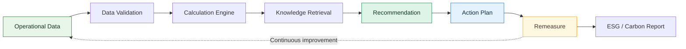
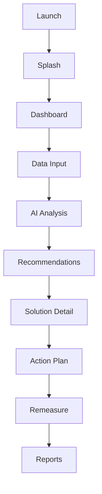
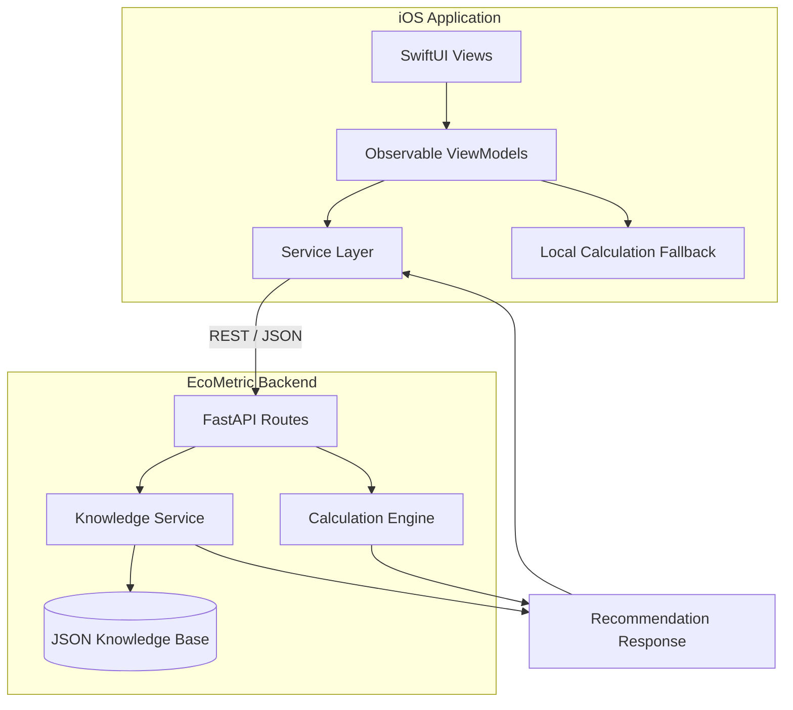
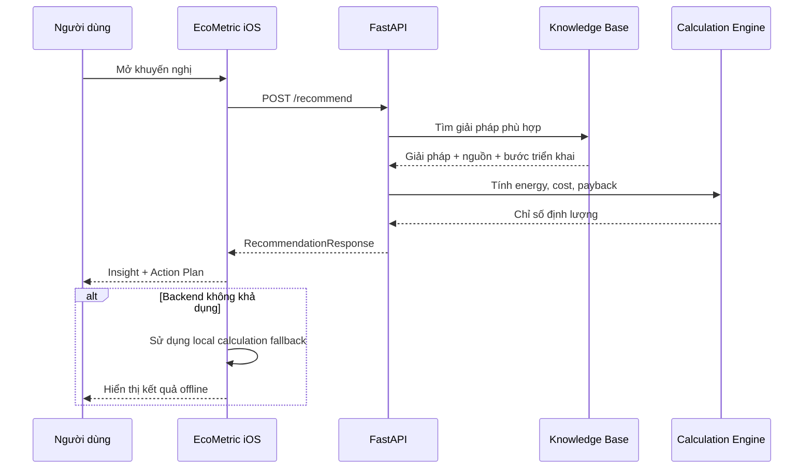
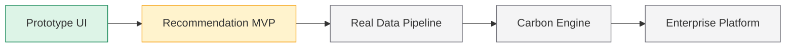

<div align="center">

# 🌱 EcoMetric

### Từ dữ liệu vận hành đến quyết định giảm phát thải có thể đo lường

EcoMetric là nền tảng iOS hỗ trợ doanh nghiệp theo dõi dữ liệu vận hành, nhận diện cơ hội tiết kiệm năng lượng và chuyển insight thành kế hoạch hành động có hiệu quả kinh tế rõ ràng.


[Tổng quan](#-tổng-quan) · [Workflow](#-product-workflow) · [Kiến trúc](#️-kiến-trúc-hệ-thống) · [Khởi chạy](#-khởi-chạy-local) · [Roadmap](#️-roadmap)

</div>

---

## 🎯 Tổng quan

EcoMetric hướng tới một vòng lặp cải tiến liên tục cho hoạt động bền vững:

> **Measure → Insight → Decide → Act → Remeasure**

Ứng dụng giúp doanh nghiệp:

- tập trung dữ liệu điện, nước, nhiên liệu và nguyên liệu;
- theo dõi phát thải CO₂e, chi phí vận hành và xu hướng bất thường;
- lượng hóa tiềm năng tiết kiệm điện và chi phí;
- nhận giải pháp dựa trên knowledge base có nguồn tham chiếu;
- xây dựng action plan và đo lại hiệu quả sau triển khai;
- chuẩn bị dữ liệu cho ESG và Carbon Reporting.

> [!IMPORTANT]
> EcoMetric hiện là **MVP đang phát triển**. Luồng khuyến nghị tiết kiệm điện đã kết nối backend thật; Dashboard, upload dữ liệu và Reports vẫn sử dụng một phần mock data hoặc simulation.

## 🔄 Product workflow



### Demo journey trên iOS



## ✨ Tính năng

| Module | Nội dung | Trạng thái |
|---|---|:---:|
| Dashboard | CO₂e, chi phí, tiềm năng tiết kiệm, biểu đồ xu hướng | 🟡 Mock data |
| Data Input | Điện, nước, nhiên liệu, nguyên liệu và file upload | 🟡 Simulation |
| Recommendation Engine | Knowledge retrieval và calculation engine | 🟢 API hoạt động |
| Solution Detail | Chỉ số tiết kiệm, hoàn vốn, nguồn và metadata | 🟢 Hoạt động |
| Action Plan | Các bước triển khai, người phụ trách, deadline, KPI | 🟢 MVP |
| Remeasure | So sánh trước và sau triển khai | 🟡 MVP demo |
| ESG / Carbon Reports | Tổng hợp nguồn phát thải và báo cáo | 🟡 Mock data |
| Authentication | Tài khoản và phân quyền doanh nghiệp | ⚪ Chưa triển khai |

## 🏗️ Kiến trúc hệ thống



### Luồng recommendation hiện tại



## 🧮 Use case đang hoạt động

MVP hiện triển khai bài toán thay đèn công suất cao bằng LED tại **Xưởng 1**.

| Thông số | Giá trị demo |
|---|---:|
| Số lượng đèn | 100 bóng |
| Công suất hiện tại | 40 W |
| Công suất đề xuất | 18 W |
| Thời gian vận hành | 16 giờ/ngày, 30 ngày/tháng |
| Giá điện | 2.367 VNĐ/kWh |
| Vốn đầu tư | 15.000.000 VNĐ |
| Điện tiết kiệm | **1.056 kWh/tháng** |
| Chi phí tiết kiệm | **2.499.552 VNĐ/tháng** |
| Thời gian hoàn vốn | **6 tháng** |

Các kết quả trên là dữ liệu minh họa. CO₂e chưa được tính cho đến khi có hệ số phát thải điện và nguồn dữ liệu được xác thực riêng.

## 🧰 Tech stack

| Layer | Công nghệ |
|---|---|
| iOS | Swift 5, SwiftUI, Swift Charts, Combine |
| Architecture | MVVM-style, service layer, local fallback |
| Backend | Python, FastAPI, Pydantic, Uvicorn |
| Knowledge base | JSON records có source metadata |
| API | REST, JSON, async URLSession |
| Testing | Python `unittest`, XCTest targets |

## 📁 Cấu trúc repository

```text
EcoMetric-iOS/
├── EcoMetric.xcodeproj/
├── EcoMetric/
│   └── EcoMetric/
│       ├── App/
│       ├── Assets.xcassets/
│       ├── Components/
│       ├── Models/
│       ├── Services/
│       ├── ViewModels/
│       └── Views/
│           ├── AI/
│           ├── Dashboard/
│           ├── Data/
│           ├── Profile/
│           └── Reports/
├── EcoMetricTests/
├── EcoMetricUITests/
└── ECOMETRIC BACKEND/
    └── ecometric-backend/
        ├── knowledge/
        ├── services/
        ├── tests/
        ├── main.py
        └── requirements.txt
```

## 🚀 Khởi chạy local

### Yêu cầu

- macOS và Xcode có iOS Simulator;
- Python 3.9 trở lên;
- Git.

### 1. Clone repository

```bash
git clone git@github.com:NXThanh01/EcoMetric-iOS.git
cd EcoMetric-iOS
```

### 2. Khởi chạy backend

```bash
cd "ECOMETRIC BACKEND/ecometric-backend"
python3 -m venv .venv
source .venv/bin/activate
python -m pip install -r requirements.txt
uvicorn main:app --reload
```

Backend mặc định chạy tại `http://127.0.0.1:8000`:

- Health check: `GET /health`
- Knowledge sample: `GET /knowledge/led`
- Recommendation: `POST /recommend`
- OpenAPI documentation: `GET /docs`

### 3. Chạy ứng dụng iOS

1. Mở `EcoMetric.xcodeproj` bằng Xcode.
2. Chọn target **EcoMetric**.
3. Chọn iOS Simulator.
4. Nhấn **Run**.

Ứng dụng mặc định gọi `http://127.0.0.1:8000`. Có thể override bằng environment variable trong Scheme:

```text
ECOMETRIC_API_BASE_URL=http://<backend-host>:8000
```

> [!NOTE]
> Khi chạy trên thiết bị iPhone thật, `127.0.0.1` trỏ tới chính điện thoại. Hãy dùng địa chỉ LAN của máy Mac chạy backend và bảo đảm hai thiết bị cùng mạng.

## 🔌 API example

<details>
<summary><strong>POST /recommend</strong></summary>

Request:

```json
{
  "facility_name": "Xưởng 1",
  "problem_type": "lighting_high_consumption",
  "lamp_quantity": 100,
  "current_power_w": 40,
  "proposed_power_w": 18,
  "hours_per_day": 16,
  "days_per_month": 30,
  "electricity_price_vnd_per_kwh": 2367,
  "investment_vnd": 15000000
}
```

Response rút gọn:

```json
{
  "facility": "Xưởng 1",
  "problem": "Thay đèn huỳnh quang bằng LED",
  "solution": "Thay 100 bóng 40W bằng LED 18W",
  "energy_saving_kwh_month": 1056,
  "cost_saving_vnd_month": 2499552,
  "cost_saving_vnd_year": 29994624,
  "investment_vnd": 15000000,
  "payback_months": 6,
  "co2_reduction": null,
  "co2_status": "Chờ xác nhận hệ số phát thải điện",
  "data_origin": "Dữ liệu minh họa"
}
```

</details>

## ✅ Kiểm thử

Backend:

```bash
cd "ECOMETRIC BACKEND/ecometric-backend"
python -m unittest discover -s tests -v
```

iOS:

```bash
xcodebuild test \
  -project EcoMetric.xcodeproj \
  -scheme EcoMetric \
  -destination 'platform=iOS Simulator,name=iPhone 17 Pro'
```

Tên simulator phụ thuộc vào phiên bản Xcode đang sử dụng.

## 🗺️ Roadmap



- [x] SwiftUI prototype và navigation flow
- [x] Dashboard, Data Input, Recommendations, Reports và Profile UI
- [x] Energy calculation engine cho use case LED
- [x] FastAPI recommendation endpoint
- [x] Knowledge base có source metadata
- [x] Local calculation fallback trên iOS
- [ ] Kết nối dữ liệu người dùng nhập với recommendation engine
- [ ] Lưu trữ dữ liệu và authentication
- [ ] Upload và xử lý file thực tế
- [ ] Carbon calculation engine với emission factors đã xác thực
- [ ] Mở rộng knowledge base cho nước, nhiên liệu và nguyên liệu
- [ ] Multi-site monitoring và enterprise accounts
- [ ] TestFlight và App Store release

## 🌍 English summary

EcoMetric is an iOS sustainability MVP that transforms operational data into measurable energy-saving recommendations and actionable implementation plans. The current vertical slice combines a SwiftUI client, a FastAPI backend, a source-aware JSON knowledge base, and a deterministic calculation engine. Dashboard, data upload, and reporting modules are still partially simulated while the real data pipeline is being developed.

## 🔒 Ownership and license

EcoMetric is proprietary intellectual property owned by **Nguyễn Xuân Thành**.

Public access to this repository does **not** grant permission to copy, modify, redistribute, commercialize, rebrand, or create derivative works. All source code, product concepts, architecture, workflows, UI/UX, branding, mockups, documentation, and related assets are protected.

**Public repository ≠ Open-source license**

Copyright © 2026 Nguyễn Xuân Thành. All Rights Reserved.
