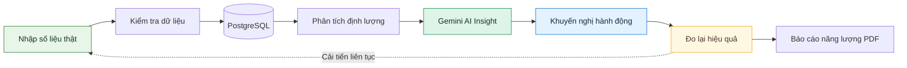
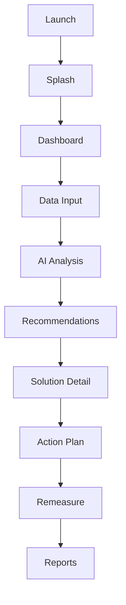
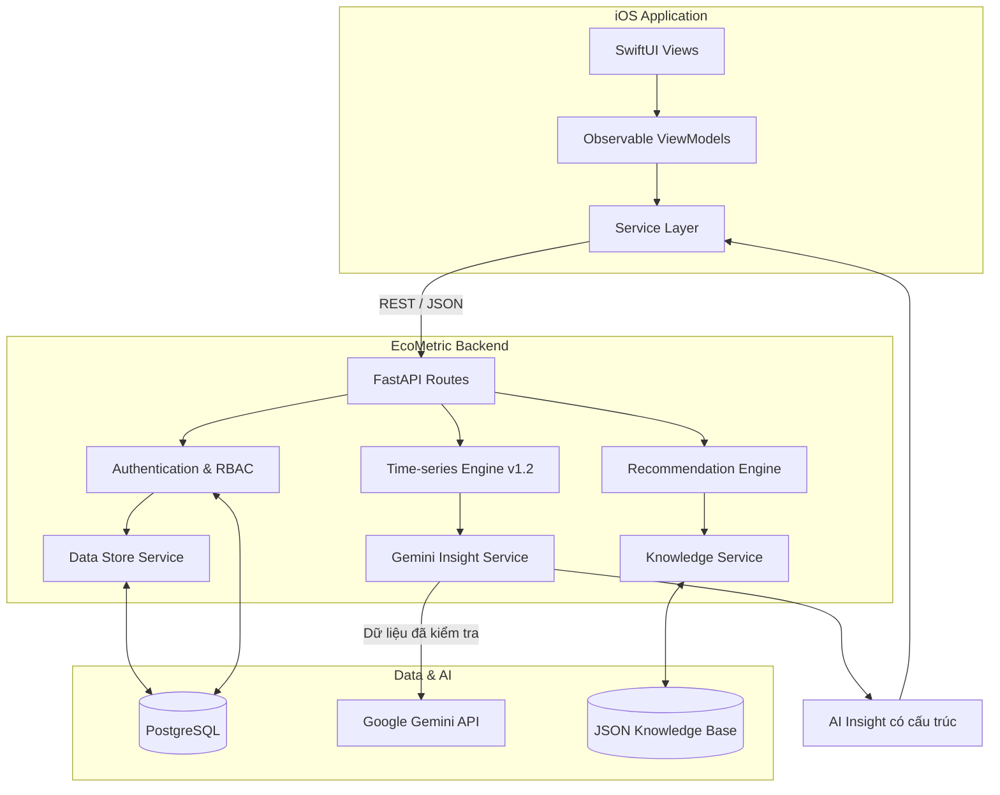
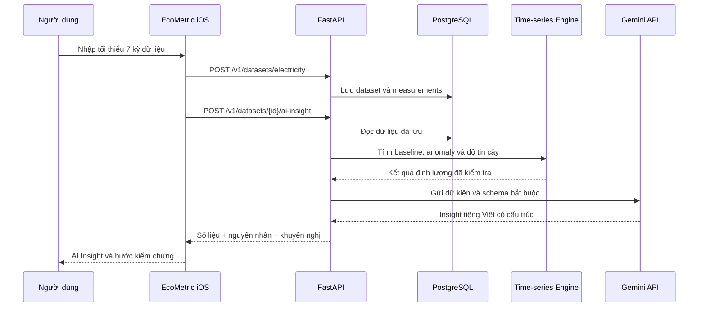
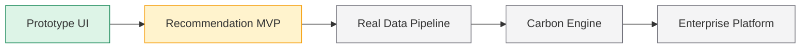

<div align="left">

# 🌱 EcoMetric

### Từ dữ liệu vận hành đến quyết định giảm phát thải có thể đo lường

EcoMetric là nền tảng iOS hỗ trợ doanh nghiệp theo dõi dữ liệu vận hành, nhận diện cơ hội tiết kiệm năng lượng và chuyển insight thành kế hoạch hành động. Số liệu được tính bằng engine xác định; Gemini phân tích ngữ cảnh, nêu giả thuyết và đề xuất giải pháp có thể kiểm chứng.


[Tổng quan](#-tổng-quan) · [Workflow](#-product-workflow) · [Kiến trúc](#️-kiến-trúc-hệ-thống) · [Khởi chạy](#-khởi-chạy-local) · [Roadmap](#️-roadmap)

</div>

---

## 🎯 Tổng quan

EcoMetric hướng tới một vòng lặp cải tiến liên tục cho hoạt động bền vững:

> **Measure → Insight → Decide → Act → Remeasure**

Ứng dụng giúp doanh nghiệp:

- tập trung dữ liệu điện, nước, nhiên liệu và nguyên liệu;
- theo dõi phát thải CO₂e, chi phí vận hành và xu hướng bất thường;
- lượng hóa tiềm năng tiết kiệm điện và chi phí;
- nhận giải pháp dựa trên knowledge base có nguồn tham chiếu;
- xây dựng action plan và đo lại hiệu quả sau triển khai;
- chuẩn bị dữ liệu cho ESG và Carbon Reporting.

> [!IMPORTANT]
> EcoMetric hiện là **MVP đang phát triển**. Luồng đăng ký doanh nghiệp, phân quyền nhân viên, nhập dữ liệu điện, lưu PostgreSQL, phát hiện bất thường, tạo AI Insight bằng Gemini và xuất báo cáo năng lượng PDF đã hoạt động end-to-end. Dashboard vẫn còn sử dụng một phần dữ liệu minh họa; Carbon Reporting chỉ được bật sau khi có emission factor đã xác thực.

## 🔄 Product workflow



### Demo journey trên iOS



## ✨ Tính năng

| Module | Nội dung | Trạng thái |
|---|---|:---:|
| Dashboard | CO₂e, chi phí, tiềm năng tiết kiệm, biểu đồ xu hướng | 🟡 Mock data |
| Data Input | Nhập số liệu điện, sản lượng, giờ vận hành và lưu PostgreSQL | 🟢 Hoạt động |
| Time-series Engine | Đường cơ sở, chuẩn hóa, anomaly detection và chẩn đoán định lượng | 🟢 Engine v1.2 |
| Gemini AI Insight | Diễn giải dữ liệu thật, giả thuyết nguyên nhân và hành động kiểm chứng | 🟢 Hoạt động |
| Recommendation Engine | Kịch bản, xếp hạng và giải thích giải pháp tiết kiệm | 🟢 Engine v1.0 |
| Solution Detail | Chỉ số tiết kiệm, hoàn vốn, nguồn và metadata | 🟢 Hoạt động |
| Action Plan | Các bước triển khai, người phụ trách, deadline, KPI | 🟢 MVP |
| Remeasure | So sánh trước và sau triển khai | 🟡 MVP demo |
| Energy Reports | Chỉ số và biểu đồ từ số đo thật, giải pháp AI và xuất PDF A4 | 🟢 Hoạt động |
| ESG / Carbon Reports | Chờ Carbon Engine và emission factor đã xác thực | ⚪ Kế hoạch |
| Enterprise Account | Đăng ký công ty qua OTP email, đăng nhập và phiên bảo mật trong Keychain | 🟢 Hoạt động |
| Role & Member Management | Cấp quyền theo email, gửi thư mời và bắt buộc đổi mật khẩu tạm | 🟢 Hoạt động |
| Tenant Isolation | Tách cơ sở, dataset và số đo theo từng doanh nghiệp | 🟢 Hoạt động |

## 🏗️ Kiến trúc hệ thống



### Phân biệt kết quả tính toán và AI

- **Engine tính toán**: baseline, điện năng, mức vượt chuẩn, tỷ lệ bất thường và độ tin cậy. Đây là các số liệu xác định, có thể kiểm tra lại.
- **AI đề xuất**: tóm tắt cho quản lý, giả thuyết nguyên nhân, giải pháp ưu tiên và câu hỏi cần xác minh. Mọi nội dung do Gemini sinh đều có nhãn `AI đề xuất` trên iOS.

### Mô hình phân quyền doanh nghiệp

| Vai trò | Quyền chính |
|---|---|
| Chủ doanh nghiệp | Quản lý toàn bộ thành viên, cấp/hủy quyền admin, kích hoạt/vô hiệu hóa tài khoản |
| Admin | Tạo và quản lý tài khoản nhân viên; không thể thay đổi chủ doanh nghiệp hoặc admin khác |
| Nhân viên | Nhập, xem và phân tích dữ liệu trong phạm vi công ty |

Tài khoản đầu tiên khi đăng ký công ty tự động là **Chủ doanh nghiệp**. Chủ doanh nghiệp hoặc admin thêm nhân viên bằng email; gói Business hiện có giới hạn mặc định 10 tài khoản.

Email đăng ký phải được xác minh bằng OTP 6 số. Mã có hiệu lực 10 phút, tối đa 5 lần nhập sai và chờ 60 giây trước khi gửi lại.

Khi quản lý tạo nhân viên, EcoMetric gửi email gồm tên doanh nghiệp, vai trò, email đăng nhập và mật khẩu tạm. Mật khẩu này hết hạn sau 24 giờ; nhân viên bắt buộc đổi mật khẩu ngay lần đăng nhập đầu tiên.

### Luồng AI Insight từ dữ liệu thật



## 🧮 Use case đang hoạt động

MVP hiện triển khai bài toán thay đèn công suất cao bằng LED tại **Xưởng 1**.

| Thông số | Giá trị demo |
|---|---:|
| Số lượng đèn | 100 bóng |
| Công suất hiện tại | 40 W |
| Công suất đề xuất | 18 W |
| Thời gian vận hành | 16 giờ/ngày, 30 ngày/tháng |
| Giá điện | 2.367 VNĐ/kWh |
| Vốn đầu tư | 15.000.000 VNĐ |
| Điện tiết kiệm | **1.056 kWh/tháng** |
| Chi phí tiết kiệm | **2.499.552 VNĐ/tháng** |
| Thời gian hoàn vốn | **6 tháng** |

Các kết quả trên là dữ liệu minh họa. CO₂e chưa được tính cho đến khi có hệ số phát thải điện và nguồn dữ liệu được xác thực riêng.

## 🧰 Tech stack

| Layer | Công nghệ |
|---|---|
| iOS | Swift 5, SwiftUI, Swift Charts, Combine |
| Architecture | MVVM-style, service layer, REST API |
| Backend | Python, FastAPI, Pydantic, SQLAlchemy, Uvicorn |
| Database | PostgreSQL 17, Alembic migrations |
| Generative AI | Google Gemini API, structured output, model fallback |
| Knowledge base | JSON records có source metadata |
| API | REST, JSON, async URLSession |
| Testing | Python `unittest`, XCTest, XCUITest |

## 📁 Cấu trúc repository

```text
EcoMetric-iOS/
├── EcoMetric.xcodeproj/
├── EcoMetric/
│   └── EcoMetric/
│       ├── App/
│       ├── Assets.xcassets/
│       ├── Components/
│       ├── Models/
│       ├── Services/
│       ├── ViewModels/
│       └── Views/
│           ├── AI/
│           ├── Dashboard/
│           ├── Data/
│           ├── Profile/
│           └── Reports/
├── EcoMetricTests/
├── EcoMetricUITests/
└── ECOMETRIC BACKEND/
    └── ecometric-backend/
        ├── knowledge/
        ├── migrations/
        ├── services/
        ├── tests/
        ├── database.py
        ├── db_models.py
        ├── gemini_schemas.py
        ├── main.py
        ├── settings.py
        └── requirements.txt
```

## 🚀 Khởi chạy local

### Yêu cầu

- macOS và Xcode có iOS Simulator;
- Python 3.10 trở lên (khuyến nghị 3.12+);
- PostgreSQL 17;
- Gemini API key từ Google AI Studio;
- Git.

### 1. Clone repository

```bash
git clone git@github.com:NXThanh01/EcoMetric-iOS.git
cd EcoMetric-iOS
```

### 2. Khởi chạy backend

```bash
cd "ECOMETRIC BACKEND/ecometric-backend"
python3 -m venv .venv
source .venv/bin/activate
python -m pip install -r requirements.txt
cp .env.example .env
```

Mở `.env` và điền thông tin PostgreSQL cùng Gemini API key. Không commit file này:

```text
ECOMETRIC_DB_HOST=127.0.0.1
ECOMETRIC_DB_PORT=5432
ECOMETRIC_DB_NAME=ecometric_dev
ECOMETRIC_DB_USER=ecometric_app
ECOMETRIC_DB_PASSWORD=mat_khau_postgresql
ECOMETRIC_GEMINI_API_KEY=api_key_tu_google_ai_studio
ECOMETRIC_GEMINI_MODEL=gemini-3.8-flash
ECOMETRIC_GEMINI_FALLBACK_MODEL=gemini-3.5-flash
ECOMETRIC_EMAIL_DELIVERY_MODE=smtp
ECOMETRIC_SMTP_HOST=smtp.gmail.com
ECOMETRIC_SMTP_PORT=587
ECOMETRIC_SMTP_USERNAME=email_cua_ban@gmail.com
ECOMETRIC_SMTP_PASSWORD=mat_khau_ung_dung
ECOMETRIC_SMTP_FROM_EMAIL=email_cua_ban@gmail.com
ECOMETRIC_SMTP_USE_TLS=true
ECOMETRIC_OTP_SECRET=chuoi_bi_mat_ngau_nhien
```

Tạo cấu trúc database và chạy API:

```bash
./.venv/bin/alembic upgrade head
./.venv/bin/python run.py --reload
```

Backend mặc định chạy tại `http://127.0.0.1:8000`:

- Health check: `GET /health`
- Gửi OTP đăng ký: `POST /v1/auth/registration-otp`
- Đăng ký công ty: `POST /v1/auth/register-company`
- Đăng nhập: `POST /v1/auth/login`
- Đổi mật khẩu tạm: `POST /v1/auth/change-password`
- Thông tin tài khoản: `GET /v1/auth/me`
- Quản lý nhân viên: `GET/POST/PATCH /v1/organization/members`
- Tạo cơ sở: `POST /v1/facilities`
- Lưu dữ liệu điện thật: `POST /v1/datasets/electricity`
- Phân tích định lượng: `POST /v1/datasets/{id}/analyze`
- Gemini AI Insight: `POST /v1/datasets/{id}/ai-insight`
- Knowledge sample: `GET /knowledge/led`
- Opportunity detection: `POST /analyze`
- Time-series anomaly detection: `POST /analyze/time-series`
- Ranked recommendations: `POST /recommendations`
- Top recommendation cho iOS hiện tại: `POST /recommend`
- OpenAPI documentation: `GET /docs`

Kiểm tra nhanh toàn bộ backend qua HTTP thật trong một Terminal khác:

```bash
cd "ECOMETRIC BACKEND/ecometric-backend"
./.venv/bin/python scripts/smoke_test.py
```

### 3. Chạy ứng dụng iOS

1. Mở `EcoMetric.xcodeproj` bằng Xcode.
2. Chọn target **EcoMetric**.
3. Chọn iOS Simulator.
4. Nhấn **Run**.

Ứng dụng mặc định gọi `http://127.0.0.1:8000`. Có thể override bằng environment variable trong Scheme:

```text
ECOMETRIC_API_BASE_URL=http://<backend-host>:8000
```

> [!NOTE]
> Khi chạy trên thiết bị iPhone thật, `127.0.0.1` trỏ tới chính điện thoại. Hãy dùng địa chỉ LAN của máy Mac chạy backend và bảo đảm hai thiết bị cùng mạng.

## 🔌 API example

<details open>
<summary><strong>POST /v1/datasets/{id}/ai-insight</strong></summary>

Endpoint đọc dữ liệu đã lưu trong PostgreSQL, chạy Time-series Engine trước rồi mới dùng Gemini để diễn giải. Phản hồi rút gọn:

```json
{
  "provider": "gemini",
  "model": "gemini-3.8-flash",
  "facility": "Xưởng 1",
  "quantitative_analysis": {
    "engine_version": "1.2.0",
    "confidence": 0.76,
    "summary": {
      "status": "attention",
      "total_excess_kwh": 60.0,
      "anomaly_rate_percent": 14.3
    }
  },
  "insight": {
    "headline": "Phát hiện một kỳ tiêu thụ điện bất thường",
    "root_causes": [],
    "recommendations": [],
    "caveats": [],
    "follow_up_questions": []
  }
}
```

Các con số định lượng do backend tính toán. Gemini không được phép tự tạo chi phí, tỷ lệ tiết kiệm hoặc biến giả thuyết thành kết luận chắc chắn.

</details>

<details>
<summary><strong>POST /recommend</strong></summary>

Request:

```json
{
  "facility_name": "Xưởng 1",
  "problem_type": "lighting_high_consumption",
  "lamp_quantity": 100,
  "current_power_w": 40,
  "proposed_power_w": 18,
  "hours_per_day": 16,
  "days_per_month": 30,
  "electricity_price_vnd_per_kwh": 2367,
  "investment_vnd": 15000000
}
```

Response rút gọn:

```json
{
  "facility": "Xưởng 1",
  "problem": "Thay đèn huỳnh quang bằng LED",
  "solution": "Thay 100 bóng 40W bằng LED 18W",
  "energy_saving_kwh_month": 1056,
  "cost_saving_vnd_month": 2499552,
  "cost_saving_vnd_year": 29994624,
  "investment_vnd": 15000000,
  "payback_months": 6,
  "co2_reduction": null,
  "co2_status": "Chờ xác nhận hệ số phát thải điện",
  "data_origin": "Dữ liệu minh họa"
}
```

</details>

## ✅ Kiểm thử

Backend:

```bash
cd "ECOMETRIC BACKEND/ecometric-backend"
python -m unittest discover -s tests -v
```

iOS:

```bash
xcodebuild test \
  -project EcoMetric.xcodeproj \
  -scheme EcoMetric \
  -destination 'platform=iOS Simulator,name=iPhone 17 Pro'
```

Tên simulator phụ thuộc vào phiên bản Xcode đang sử dụng.

## 🗺️ Roadmap



- [x] SwiftUI prototype và navigation flow
- [x] Dashboard, Data Input, Recommendations, Reports và Profile UI
- [x] Energy calculation engine cho use case LED
- [x] FastAPI recommendation endpoint
- [x] Knowledge base có source metadata
- [x] Opportunity detection và recommendation scoring
- [x] Xếp hạng nhiều giải pháp cho cùng một vấn đề
- [x] Luật kiểm tra tính phù hợp theo từng giải pháp
- [x] Kịch bản thận trọng, kỳ vọng và lạc quan
- [x] Giải thích xếp hạng và kế hoạch đo lại
- [x] Phát hiện đột biến và xu hướng tăng từ chuỗi dữ liệu điện
- [x] Chuẩn hóa tiêu thụ theo sản lượng hoặc giờ vận hành
- [x] Hiển thị điểm AI, độ tin cậy và khoảng dự báo trên iOS
- [x] Hiển thị nhiều giải pháp theo thứ tự xếp hạng từ backend
- [x] Local calculation fallback trên iOS
- [x] Nhập dữ liệu điện thật từ iOS
- [x] Lưu facilities, datasets và measurements trong PostgreSQL
- [x] Alembic migration cho database schema
- [x] Kết nối dữ liệu đã lưu với Time-series Engine
- [x] Gemini AI Insight với structured output tiếng Việt
- [x] Tự động dùng model Gemini dự phòng khi model chính quá tải
- [x] Màn hình AI trực quan, tách rõ `Engine tính toán` và `AI đề xuất`
- [x] Báo cáo năng lượng trực quan từ dữ liệu thật và xuất PDF A4
- [x] Authentication, phiên đăng nhập và lưu token trong iOS Keychain
- [x] Xác minh email đăng ký bằng OTP 6 số
- [x] Phân quyền chủ doanh nghiệp, admin và nhân viên theo email
- [x] Gửi thư mời nhân viên và bắt buộc đổi mật khẩu tạm trong 24 giờ
- [x] Tách dữ liệu PostgreSQL theo doanh nghiệp
- [ ] Quên mật khẩu và khôi phục tài khoản
- [ ] Upload và xử lý file thực tế
- [ ] Carbon calculation engine với emission factors đã xác thực
- [ ] Mở rộng knowledge base cho nước, nhiên liệu và nguyên liệu
- [ ] Multi-site monitoring và enterprise accounts
- [ ] TestFlight và App Store release

## 🌍 English summary

EcoMetric is an iOS sustainability MVP that transforms real operational measurements into explainable energy insights, verifiable action plans, and exportable A4 energy reports. The current end-to-end flow combines a SwiftUI client, FastAPI, PostgreSQL, deterministic time-series analysis, structured Gemini AI output, charts, and native PDF generation. Quantitative values are calculated by the backend; Gemini is used for grounded interpretation, hypotheses, and recommended verification steps. The dashboard remains partially simulated, while Carbon Reporting is intentionally deferred until verified emission factors are available.

## 🔒 Ownership and license

EcoMetric is proprietary intellectual property owned by **Nguyễn Xuân Thành**.

Public access to this repository does **not** grant permission to copy, modify, redistribute, commercialize, rebrand, or create derivative works. All source code, product concepts, architecture, workflows, UI/UX, branding, mockups, documentation, and related assets are protected.

**Public repository ≠ Open-source license**

Copyright © 2026 Nguyễn Xuân Thành. All Rights Reserved.
